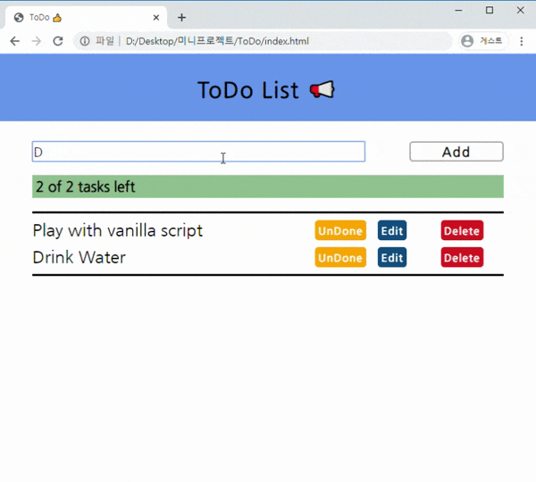

# ToDo-List

  </img>

기본적인 ToDo List 입니다.
vanilla script, html, css 만을 이용하였습니다.

- 해야할 것들
  - [x] 리스트 편집시 글자크기
  - [x] 리스트 버튼 위치 조절
  - [x] 리스트 편집 버튼
  - [x] UnDone 버튼시 글자 가운데 줄 안생김 해결
  - [x] 리스트 조작 버튼 css 간격 조정
  - [x] 리스트 삭제 버튼
  - [x] 로컬 저장소에 저장 및 불러오기 기능
